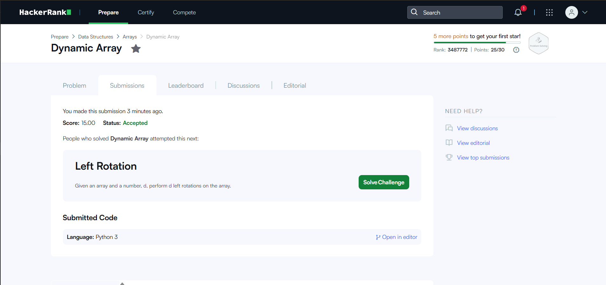
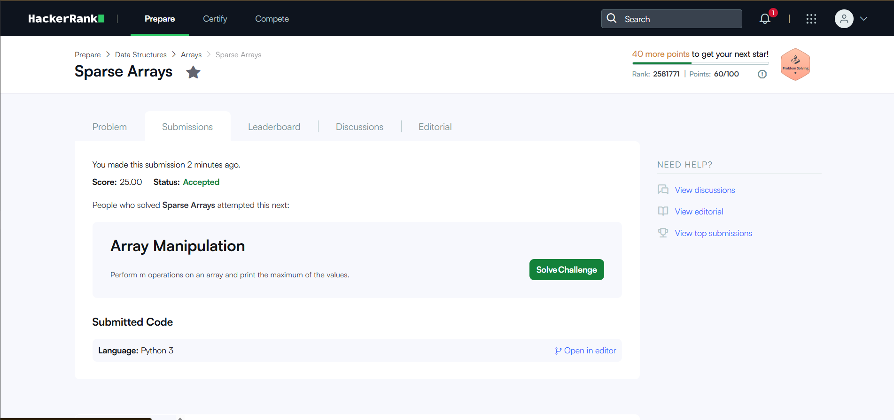

# HackerRank 3rd Semester Portfolio

## HackerRank Profile

[My HackerRank Profile]: https://www.hackerrank.com/profile/rishit11105

## Problems Solved

| # | Problem | Topic | Time Complexity | Space Complexity |
|---|---|---|---|---|
| 1 | Diagonal Difference | 2D Arrays / Matrices | O(N) | O(1) |
| 2 | Dynamic Array | Data Structures / Vectors | O(N + Q) | O(N) |
| 3 | Time Conversion | Strings & Logic | O(1) | O(1) |
| 4 | Compare the Triplets | Basic Implementation | O(1) | O(1) |
| 5 | Sparse Arrays | Hash Maps / Strings | O(N + Q) | O(N) |

## HackerRank Badge

## Accepted Submissions

### 1. Diagonal Difference

### 2. Dynamic Array

### 3. Time Conversion

### 4. Compare the Triplets

### 5. Sparse Arrays

